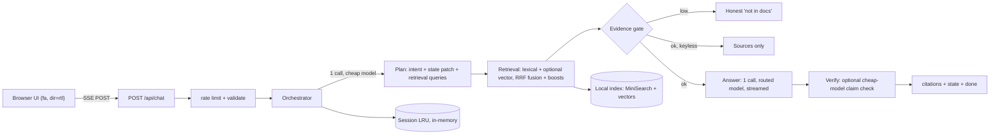

# Liara Copilot

A Persian-first, grounded AI assistant over the official [Liara.ir](https://liara.ir)
cloud platform docs. Built for the Liara AI Challenge, **Phase 1: fully local**
— no real Liara deployment, no real Liara account/API connection. Both are
prepared in code and documented for later (see [Current limitations](#current-limitations)
and [docs/DEPLOYMENT.md](docs/DEPLOYMENT.md)).

## The problem

Liara users open support tickets because they cannot find, understand,
connect, or apply the official documentation. Liara Copilot moves a user from
"I have a problem" to "verified resolved," with every claim traceable to a
specific docs page and section.

## What it does

One conversational interface — no mode tabs — that infers per message whether
the user needs:

- **Ask** — a grounded answer with citations to exact doc sections (deep
  `#anchor` links where recoverable, page URL otherwise).
- **Fix** — stateful troubleshooting: ranked hypotheses, one diagnostic step
  at a time, wait for the result, adapt, explicit `Resolved ✓` with root
  cause.
- **Guide** — a stateful multi-step workflow checklist (e.g. "Django +
  PostgreSQL, deploy on Liara"), one next step per turn.

Other features:

- **Evidence gate** — below a measured confidence threshold the assistant
  will not answer; it asks one targeted clarification or says the docs don't
  establish the answer, instead of guessing.
- **Claim verification** — an optional post-answer pass checks Liara-specific
  claims against the retrieved evidence and appends a correction note if
  something is unsupported.
- **Conversation state** — product/platform/language/db/package manager,
  known error, tried actions, hypothesis ledger, workflow steps, expertise
  level. Never re-asked once known; a rolling ≤900-char summary stands in for
  full history.
- **Troubleshooting & workflow UI** — hypothesis ledger and step checklist
  rendered live from server-pushed state.
- **Personalization** — beginner/intermediate/advanced inferred from
  conversation, adjusts verbosity and step granularity. No questionnaire.
- **Persian-first RTL UI** — `dir=rtl` root, `dir=auto` per message, LTR code
  blocks and URLs, natural Persian with English technical identifiers intact.
- **Cost controls** — ≤2 model calls per message (plan + answer) plus an
  optional verification call; 0 calls for greetings and keyless mode; token
  budgets per stage; FAQ answer caching; model routing (cheap vs. reasoning
  model). See [docs/COST.md](docs/COST.md).
- **Observability** — structured JSON logs per request (latencies, tokens,
  cost estimate, cache hit, retrieval confidence), a dev-only `/api/diag`
  panel (last 20 pipeline traces + gap log), a documentation-gap recorder for
  low-confidence/unhelpful questions.

## Architecture overview

Next.js 15 App Router modular monolith. No database — a local lexical index
(MiniSearch) built from the docs repo, optional vector search, in-memory LRU
sessions, JSONL for feedback/gap logs.



Full request lifecycle, retrieval pipeline internals, and the model-provider
abstraction are in [docs/ARCHITECTURE.md](docs/ARCHITECTURE.md) and
[docs/RETRIEVAL.md](docs/RETRIEVAL.md).

## Quick start

```bash
npm install
cp .env.example .env        # all keys optional — see below
npm run index                # sync-docs + build-index (~1-2 min, no key needed)
npm run dev                  # http://localhost:3000
```

Without any `AI_*` key configured, the app runs in **degraded keyless mode**:
retrieval works fully, and instead of a generated answer the assistant
returns the closest official docs pages as sources (honest, not a fake
answer). Set `AI_BASE_URL` + `AI_API_KEY` to enable generation.

## Environment variables

All parsed and defaulted in `src/lib/config.ts`.

| Variable | Default | Notes |
|---|---|---|
| `AI_BASE_URL` | — | OpenAI-compatible base URL (Liara AI, OpenRouter, Ollama, OpenAI). |
| `AI_API_KEY` | — | Secret. Server-side only, never sent to the browser. |
| `AI_MODEL_FAST` | `openai/gpt-4.1-mini` | Planning, verification, simple grounded answers. |
| `AI_MODEL_SMART` | = `AI_MODEL_FAST` | Troubleshooting/workflow reasoning, non-high-confidence answers. |
| `AI_EMBEDDINGS_MODEL` | — | Unset ⇒ lexical-only index. Set ⇒ hybrid retrieval turns on automatically. |
| `VERIFY_CLAIMS` | `on` | Post-answer grounding check (`on`\|`off`). |
| `MODEL_TIMEOUT_MS` | `30000` | Hard timeout per model call. |
| `MODEL_MAX_RETRIES` | `2` | Retries on 429/500/502/503/504 and network/timeout errors. |
| `COST_INPUT_PER_MTOK` / `COST_OUTPUT_PER_MTOK` | — | USD/1M tokens; enables `estimated_cost` in metrics. |
| `RATE_LIMIT_RPM` | `20` | Per-client-IP token bucket, plus a global 10× backstop. |
| `TRUST_PROXY` | `off` | `on` only behind a proxy that sets `x-forwarded-for` (Liara LB). Default fail-closed. |
| `MAX_INPUT_CHARS` | `8000` | Chat message length cap. |
| `MAX_BODY_BYTES` | `64000` | Enforced on the streamed body, not just the header. |
| `DOCS_DIR` | `data/liara-docs` | Where `npm run sync-docs` clones the docs repo. |
| `INDEX_DIR` | `data/index` | Built index artifacts. |
| `RUNTIME_DIR` | `data/runtime` | `feedback.jsonl`, `gaps.jsonl`. |
| `DIAG_ENABLED` | dev: on, prod: off | Overrides the `/api/diag` visibility default. |
| `NODE_ENV` | `development` | Standard Next.js semantics. |

## Indexing, evals, tests

```bash
npm run index               # sync-docs + build-index
npm run build-index          # rebuild from an already-cloned data/liara-docs
npm run evaluate              # retrieval-only eval (no key needed)
npm run evaluate:retrieval    # same, explicit
npm run evaluate -- --answers # LLM-judged answer eval — needs a running server + AI key
npm test                      # vitest — 81 tests, 9 files
npm run typecheck
```

## Evaluation results (measured, not assumed)

Retrieval eval, `evals/results/retrieval-2026-08-20.json`: 57 cases across 20
categories, single raw-question query, **lexical-only** (no embeddings model
configured at eval time).

| Metric | Value |
|---|---|
| hit@1 | 31% |
| hit@3 | 63% |
| hit@5 | 68.8% |
| MRR | 0.473 |
| Gate accuracy | 9/9 — no ambiguous/unsupported/adversarial case returns `high` confidence |

This is a **lower bound**: it queries the raw question once with no filters.
The live chat pipeline additionally does bounded LLM query rewriting (≤3
queries) and applies metadata filters derived from conversation state, both
of which measurably help (e.g. platform-in-query boost, EN→FA expansion).
See [docs/EVALUATION.md](docs/EVALUATION.md) for the full per-category table
and the actual missed cases.

Vector/hybrid retrieval exists (`AI_EMBEDDINGS_MODEL` + a configured key) but
is **unmeasured** — no embeddings model was configured for this eval run.

Answer-quality eval (LLM-judged, `scripts/evaluate.ts --answers`) is
implemented but **not yet run** — it requires a configured AI provider key
for the judge model and a running server.

Tests: **81 passing** (`vitest run`, 9 files). `npm run build` succeeds
cleanly. Keyless mode returns honest sources-only answers (see above), tested
in `tests/orchestrator.test.ts`.

## Production build & Docker

```bash
npm run build && npm start
```

```bash
docker build -t liara-copilot .
docker run -p 3000:3000 --env-file .env liara-copilot
```

The Dockerfile bakes the **lexical-only** index into the image at build time
(`npm run sync-docs && npx tsx scripts/build-index.ts`, no API key required).
Shipping a vector-enabled image requires building `data/index` with
`AI_EMBEDDINGS_MODEL`/`AI_BASE_URL`/`AI_API_KEY` set and copying it in — see
[docs/DEPLOYMENT.md](docs/DEPLOYMENT.md).

## Current limitations

- **Phase 1 has no real Liara account connection.** `LiaraProvider` (read-only
  interface: apps, deployments, logs, envs, domains, databases — no
  destructive operations by design) has one implementation,
  `MockLiaraProvider` (`src/lib/liara/mock.ts`), and it is not currently
  wired into the agent's conversation loop. It exists as the seam for a
  future `RealLiaraProvider`.
- **No real Liara deployment in this phase.** `Dockerfile` + `liara.json` +
  this doc set are prepared and unexecuted.
- **Single-instance ceilings, documented in code:** sessions
  (`src/lib/state/sessions.ts`) and the rate limiter
  (`src/lib/security/ratelimit.ts`) are in-memory; a restart forgets
  conversations; multi-instance deploys need a shared store swapped in behind
  the same small interfaces.
- **Vector/hybrid retrieval is implemented but unmeasured** — the committed
  eval ran lexical-only.
- **Answers-mode eval has not been run** — no AI key was configured for this
  submission's eval pass.
- **Anchor coverage is 36.6%** of chunks (recovered from authored MDX
  `<Section id>` props); the remainder cite the page URL without a deep
  anchor.
- **The retrieval gate is lexical, and by design not a topic classifier.** It
  reliably refuses gibberish and all-stopword input (gate `low`), but an
  off-topic question that shares a real Liara word ("cake **recipe**" →
  "recipe"; a cooking "**دستور**" collides with CLI "دستور/command") lands at
  `medium` — lexically indistinguishable from a legitimate one-concept query.
  Those are defended at the next layer: the answer model is instructed to
  answer only from evidence and otherwise say "not in the docs", and the
  claim-verification stage flags unsupported claims. Two eval gate cases
  (`crlf-bad-interpreter`, `adversarial-destructive`) are accepted debt for
  the same reason — see [docs/EVALUATION.md](docs/EVALUATION.md).

## Future work

- Swap `MockLiaraProvider` for a `RealLiaraProvider` behind the same
  `LiaraProvider` interface; add explicit user-confirmation UX before any
  future mutating call (none exist in the interface today).
- Deploy via `liara.json` + `Dockerfile` once account access is available.
- Run the answers-mode eval and hybrid/vector retrieval eval with a
  configured `AI_*` key; compare against the lexical-only baseline above.

## Documentation set

- [docs/ARCHITECTURE.md](docs/ARCHITECTURE.md) — request lifecycle, pipeline stages, state, model routing, security boundaries.
- [docs/RETRIEVAL.md](docs/RETRIEVAL.md) — ingestion, chunking, anchors, Persian normalization, index, fusion, gate.
- [docs/EVALUATION.md](docs/EVALUATION.md) — dataset, metrics, per-category table, named failure cases, judge schema.
- [docs/SECURITY.md](docs/SECURITY.md) — threat model, secrets, rate limiting, validation, rendering safety.
- [docs/COST.md](docs/COST.md) — token budgets, routing, caching, request classes.
- [docs/DESIGN.md](docs/DESIGN.md) — UI/UX decisions, RTL, progressive disclosure, accessibility.
- [docs/DEPLOYMENT.md](docs/DEPLOYMENT.md) — future Liara deployment plan (not executed).
- [docs/DECISIONS.md](docs/DECISIONS.md) — architectural decision log (D1–D8).
