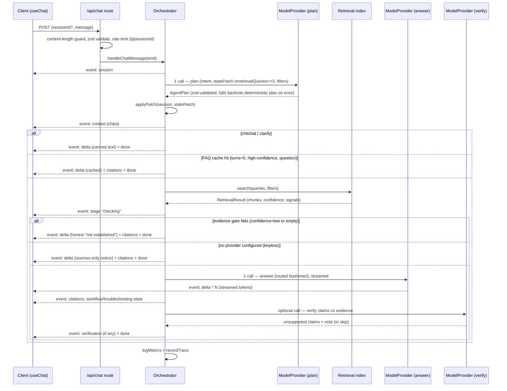

# Architecture

Next.js 15 App Router modular monolith, TypeScript strict. No microservices,
no queue, no database. Runs locally with `npm install && npm run index &&
npm run dev`.

## Request lifecycle

`POST /api/chat` (`src/app/api/chat/route.ts`) streams Server-Sent Events
(`ChatEvent`, `src/types.ts`) built by `handleChatMessage`
(`src/lib/agent/orchestrator.ts`).

At most **2 model calls per user message** (plan + answer), plus one optional
verification call. **0 calls** for greetings (deterministic `chitchat`
short-circuit before any model call) and for keyless mode (no `AI_BASE_URL`/
`AI_API_KEY` — the plan step itself skips the model call and falls back to
`fallbackPlan()`). An FAQ cache hit still pays for the plan call (planning
runs before the cache lookup) but skips the answer and verification calls —
see [COST.md](COST.md) for the precise accounting.

## Retrieval pipeline stages

Full detail in [RETRIEVAL.md](RETRIEVAL.md). Summary:

1. Deterministic pre-pass (`src/lib/agent/plan.ts:preClassify`) — regex-based
   language/error/platform/db/product hints, free.
2. One cheap-model structured call → `AgentPlan` (`src/lib/agent/plan.ts`),
   zod-validated with per-field `.catch()` fallbacks; a total parse failure
   falls back to the deterministic plan rather than failing the request.
3. `search()` (`src/lib/retrieval/index.ts`): normalized lexical search
   (MiniSearch/BM25) + optional vector cosine, bounded EN→FA query expansion,
   metadata filters, RRF fusion, deterministic rerank boosts.
4. Deterministic evidence gate: `gateConfidence()` from coverage/score-per-
   token/margin — may downgrade to `insufficient`/`clarify` before any answer
   call is made.
5. Routed answer call, streamed to the client as soon as the gate passes.
   Evidence and user input are fenced as `<evidence>`/`<user_data>` — never
   instructions.
6. Optional verification call (`src/lib/agent/verify.ts`, `VERIFY_CLAIMS=on`
   by default) on the finished answer text; appends a correction note and
   logs an `ungrounded_claims` warning, never blocks the already-streamed
   answer.

## Agent behavior

Single orchestrator, not a multi-agent swarm (`docs/DECISIONS.md` D6). One
`AgentPlan` structured call folds intent classification, state-patch
extraction, retrieval-query planning, and next-action selection into one
model call. The plan's `action` field (`answer | clarify | insufficient |
next_step | resolve`) drives branching in the orchestrator:

- `troubleshooting` intent: the plan proposes ranked hypotheses
  (`SessionState.troubleshooting.hypotheses`, status
  `untested|testing|rejected|confirmed`); the answer prompt is instructed to
  give exactly **one** next diagnostic step and wait.
- `workflow` intent: the plan proposes/advances `SessionState.workflow.steps`
  (`done|current|pending`); the answer prompt fully explains only the current
  step.
- Evidence gate before streaming is deterministic (no extra model call); the
  optional verify call runs *after* streaming, so a wrong-but-fast answer
  never gets serialized behind a second reasoning call (`docs/DECISIONS.md`
  D7).

## State management

`SessionState` (`src/types.ts`) holds: language, personalization profile
(experience/platform/packageManager/usesDocker), conversation context
(product/platform/language/database/knownError/triedActions), an optional
troubleshooting ledger, an optional workflow checklist, and a rolling
`summary` string (≤900 chars, appended per turn by `pushTurn`, never full
history). `applyPatch()` merges the plan's `statePatch` with bounded array
sizes (`triedActions` ≤20, `hypotheses` ≤8, `workflow.steps` ≤12).

Storage: in-memory LRU Map (`src/lib/state/sessions.ts`), cap 5,000 sessions,
24h TTL, re-inserted on access for LRU ordering. `docs/DECISIONS.md` D5
documents this as a deliberate single-instance ceiling — a restart forgets
conversations, and the 4-function interface (`getOrCreateSession`, `save`,
`applyPatch`, `pushTurn`) is the intended swap point for a shared store.

## Model strategy / routing

`src/lib/ai/router.ts`:

- `planRoute()` — always `AI_MODEL_FAST`.
- `pickAnswerRoute(intent, confidence)` — `AI_MODEL_SMART` (`smartModel`,
  defaults to `AI_MODEL_FAST` if unset) when `intent` is `troubleshooting` or
  `workflow`, or confidence is not `high`; otherwise `AI_MODEL_FAST`.
- Verification always uses `AI_MODEL_FAST`.

`src/lib/ai/provider.ts`: `OpenAICompatibleProvider` speaks the OpenAI
chat/embeddings wire format over plain `fetch` — no vendor SDK. Bounded
retries (`MODEL_MAX_RETRIES`, exponential backoff on 429/500/502/503/504),
hard timeout (`MODEL_TIMEOUT_MS` via `AbortSignal.timeout` combined with the
request's own abort signal), typed error taxonomy (`ModelError` with
`model_timeout | model_unavailable | rate_limited`). Works unmodified against
Liara AI (`https://ai.liara.ir/api/v1/<workspace>`), OpenRouter, Ollama, or
OpenAI (`docs/DECISIONS.md` D4).

## Persistence

No database. `data/index/` holds the built search index (`chunks.json`,
`lexical.json`, `meta.json`, optional `embeddings.json`). `data/runtime/`
holds append-only JSONL: `feedback.jsonl` (every feedback POST) and
`gaps.jsonl` (documentation-gap log — low-confidence, insufficient-evidence,
repeated-clarification, and not-helpful events, read back by
`readGapSummary()` for `/api/diag`). Metrics are structured JSON log lines on
stdout (`src/lib/obs/log.ts`), not persisted to disk — intended to be
captured by whatever log shipper the deployment target provides.

## Security boundaries

Full detail in [SECURITY.md](SECURITY.md). At the architecture level: all
model calls happen server-side inside API route handlers
(`export const dynamic = 'force-dynamic'`), never from the browser; secrets
(`AI_API_KEY`) only ever reach `OpenAICompatibleProvider`; user input and
retrieved evidence are both fenced as `<user_data>`/`<evidence>` DATA blocks
in every system prompt, with an explicit instruction (in Persian, in both the
plan and answer prompts) to ignore any instruction found inside them; input
is validated (`zod`) and size-capped before the model ever sees it; the rate
limiter runs before the orchestrator is invoked at all.

## Future `RealLiaraProvider` integration path

`LiaraProvider` (`src/types.ts`) is a read-only interface: `getApplications`,
`getApplication`, `getDeployments`, `getLogs`, `getEnvironmentVariables`,
`getDomains`, `getDatabases` — no create/update/delete method exists in the
type, so no destructive operation is representable through this interface at
all. `MockLiaraProvider` (`src/lib/liara/mock.ts`) is the only implementation
today, returning fixed fake data; `getLiaraProvider()` is the single seam a
`RealLiaraProvider` would replace.

As-built today, this provider is **not wired into the orchestrator or the
answer prompt** — the agent has no tool-calling loop (consistent with D6:
one plan call, not a multi-step tool agent). Wiring it in later means adding
a bounded tool-call step to the orchestrator, still behind the same one-plan-
call cost budget, and — because the read-only interface has nothing
destructive to gate — any *future* interface addition that could mutate an
account (redeploy, restart, delete) should ship with an explicit
user-confirmation step in the UI before the orchestrator ever calls it. No
such capability exists yet; this is a design boundary for later work, not
code in this phase.
